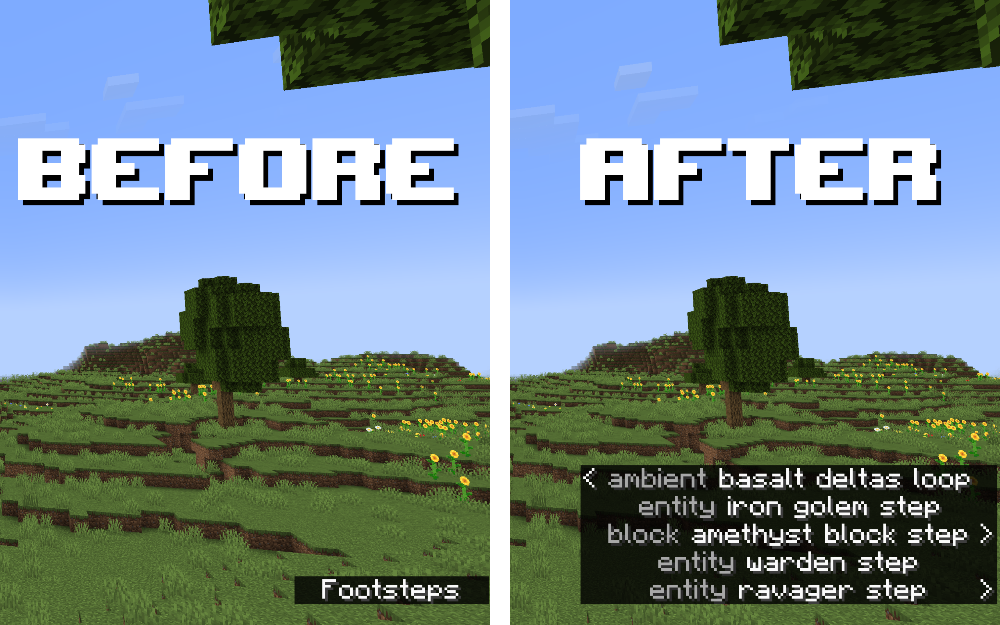

# Verbose Subtitles Resource Pack

## About

A simple 1.21 resource pack that creates unique subtitles for every sound event in Minecraft. The goal of this resource pack is to make Minecraft more accessible for anyone with auditory impairments, however it is also just generally helpful for finding hidden mobs, resources, etc.

This pack only consists of a `en_us.json` lang file, and a `sounds.json` file, so in theory it's compatible all the way down to 1.10. So far, it's only been tested in 1.21

## Known Issues

The resource pack uses the `sounds.json` file to add / redefine subtitles in-game. It should not colfict with other custom / replaced sounds, but has a high chance of breaking other resource packs that use a custom sounds.json file. 
