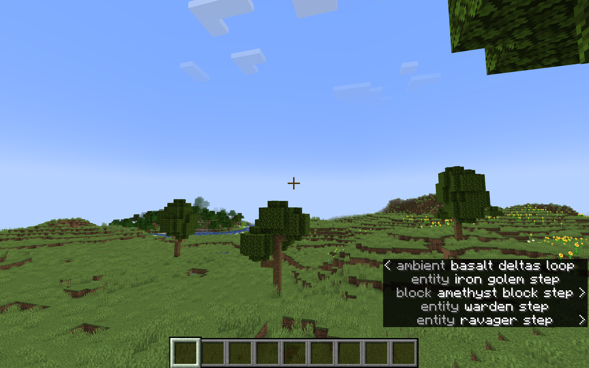

# Verbose Subtitles Resource Pack

## About

A simple resource pack that creates unique subtitles for every sound event in Minecraft.

## Known Issues

The resource pack uses the `sounds.json` file to add / redefine subtitles in-game. While this does not conflict with any sounds redefined by other resource packs, it can conflict with other resource packs that use custom `sounds.json` files.
